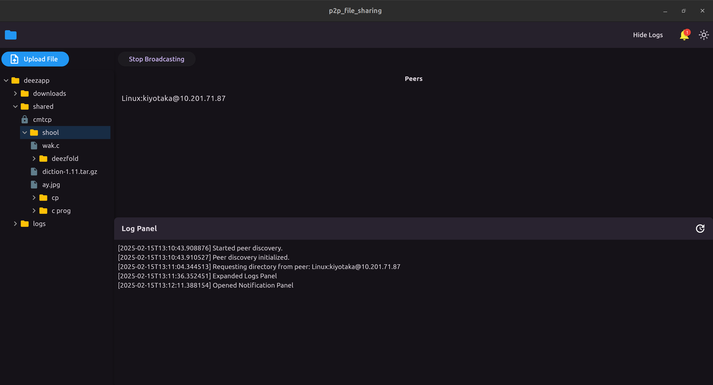
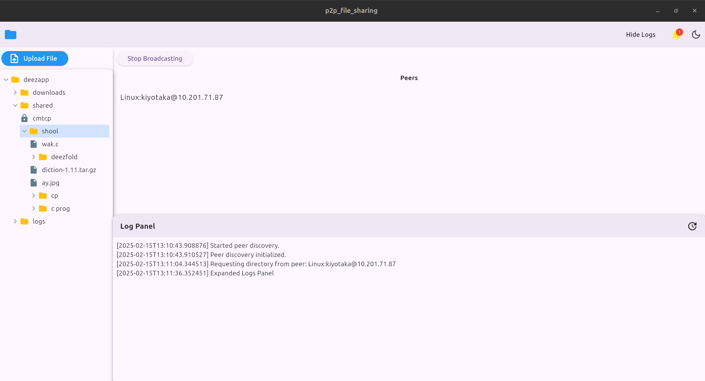
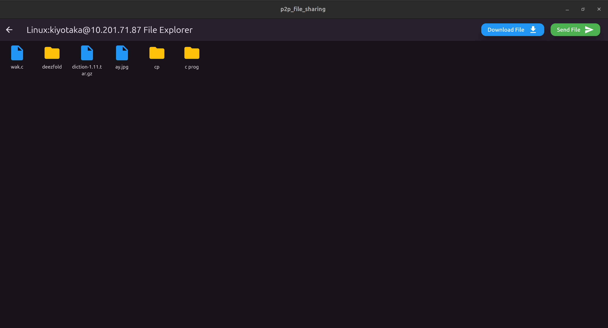
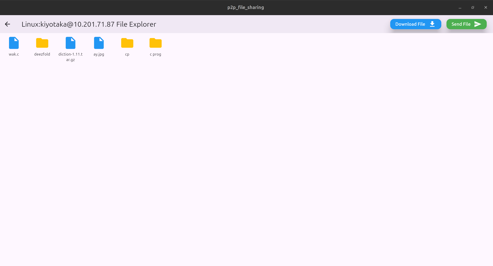

# Peer-to-Peer File Transfer App

A cross-platform desktop application (Linux, Windows, Mac) built with Flutter for seamless peer-to-peer file sharing. This app allows you to share files across devices effortlessly while providing a user-friendly interface for managing your shared files and connections.

---

## Features

### Peer Discovery
- **Automatic Discovery:** Automatically finds peers broadcasting their presence on the network.
- **Broadcast Control:** Start or stop broadcasting your presence with a single button click.

### File Management
- **Shared Folder Explorer:**
  - View files in your shared directory.
  - Manage files: delete, rename, create folders, and upload files.
- **Privacy Control:** Mark files as `public` or `private`. Only public files are visible and available for download to other peers.

### Peer Interaction
- **Peer List:** View a list of detected peers on the main screen.
- **Peer Directory:** Click on a peer to view their shared directory. Only public files are displayed.
- **File Transfer:**
  - **Download:** Select files from the peer’s directory to download.
  - **Send:** Pick any file from your system and send it to the selected peer.

### Logging
- **Log Panel:** View logs of all activities directly within the app.
- **Log File:** All logs are saved to a log file located in the app’s directory for easy access.

---

## Screenshots

1. **Home View (Dark Mode)**
   
   

2. **Home View (Light Mode)**
   
   

3. **Peer Explorer (Dark Mode)**
   
   

4. **Peer Explorer (Light Mode)**
   
   

---

## Installation

1. Clone this repository:
   ```bash
   git clone https://github.com/Kurocifer/p2p_file_sharing.git
   cd p2p_file_sharing/p2p_file_sharing
   ```
2. Install the required dependencies:
   ```bash
   flutter pub get
   ```
3. Build and run the application:
   - For Linux:
     ```bash
     flutter build linux
     ```
   - For Windows:
     ```bash
     flutter build windows
     ```
   - For Mac:
     ```bash
     flutter build macos
     ```

---

## Usage

1. Launch the application.
2. Peer discovery starts automatically, finding peers on the network. Use the broadcast button to start/stop broadcasting your presence.
3. Manage your shared folder from the file explorer on the home view.
   - Delete, rename, create folders, upload files, and toggle privacy settings for each file.
4. Click on a peer to explore their public shared directory.
   - Download public files or send files to the peer.
5. Monitor activity in the log panel or review the saved log file in the app’s directory.

---

## Technologies Used
- **Framework:** Flutter
- **Platforms:** Linux, Windows, MacOS

---

## Contributing

Contributions are welcome! If you’d like to improve this project, please fork the repository, add your changes on a new branch and create pull request for it, or you can still raise and issue.

1. Fork the repository.
2. Create your feature branch:
   ```bash
   git checkout -b feature/your-feature-name
   ```
3. Commit your changes:
   ```bash
   git commit -m 'Add some feature'
   ```
4. Push to the branch:
   ```bash
   git push origin feature/your-feature-name
   ```
5. Open a pull request.

---

## Contact

For questions or feedback, let's meet in the issue coments.